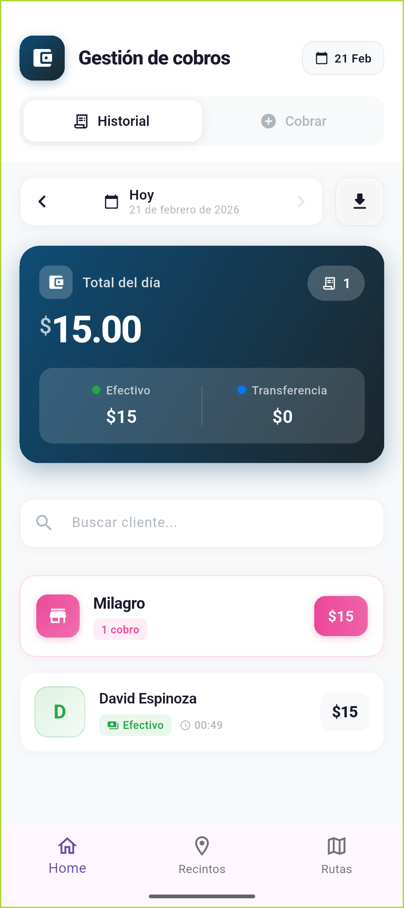
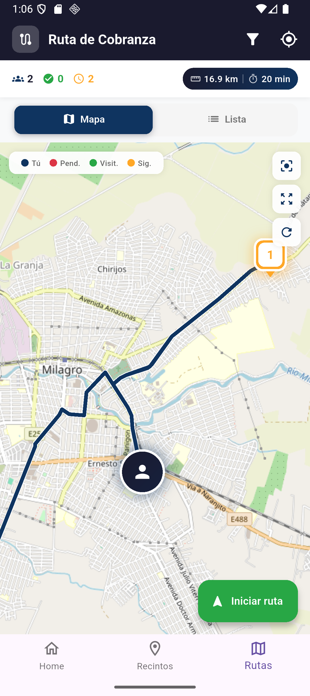
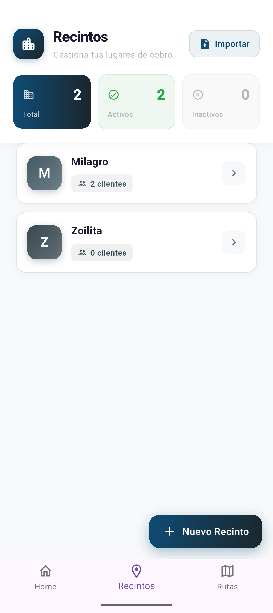
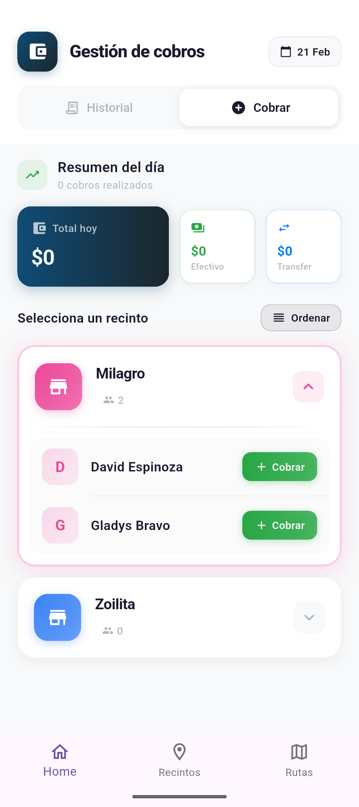

# 💰 Cobrador App

<p align="center">
  
  
  
</p>

<p align="center">
  
  
</p>

> Aplicación móvil profesional para la gestión integral de cobros, diseñada para cobradores y empresas que necesitan administrar pagos de manera eficiente.

---

## 📋 Tabla de Contenidos

- [Características](#-características)
- [Capturas de Pantalla](#-capturas-de-pantalla)
- [Arquitectura](#-arquitectura)
- [Tecnologías](#-tecnologías)
- [Requisitos](#-requisitos)
- [Instalación](#-instalación)
- [Estructura del Proyecto](#-estructura-del-proyecto)
- [Funcionalidades Principales](#-funcionalidades-principales)
- [Dependencias](#-dependencias)
- [Licencia](#-licencia)

---

## ✨ Características

### Gestión de Cobros
- ✅ Registro rápido de cobros con múltiples métodos de pago
- ✅ Adjuntar fotografías como comprobantes
- ✅ Historial completo de transacciones
- ✅ Filtrado por fechas y recintos

### Gestión de Clientes
- ✅ Alta, edición y eliminación de clientes
- ✅ Asociación de clientes por recintos/zonas
- ✅ Geolocalización de direcciones
- ✅ Búsqueda rápida de clientes

### Gestión de Recintos
- ✅ Organización de clientes por ubicación
- ✅ Configuración de zonas de trabajo
- ✅ Ordenamiento personalizado

### Rutas y Mapas
- ✅ Visualización de clientes en mapa interactivo
- ✅ Planificación de rutas de cobro
- ✅ Geolocalización en tiempo real

### Reportes
- ✅ Generación de reportes en Excel (.xlsx)
- ✅ Exportación por rango de fechas
- ✅ Resumen por recintos
- ✅ Compartir reportes directamente

### Importación de Datos
- ✅ Importación desde archivos CSV
- ✅ Importación desde archivos Excel
- ✅ Migración de datos existentes

---

## 🏗️ Arquitectura

El proyecto implementa una **arquitectura limpia (Clean Architecture)** con separación clara de responsabilidades:

```
lib/
├── config/          # Configuración de la app
│   ├── router/      # Navegación con go_router
│   └── theme/       # Tema y estilos de la app
├── domain/          # Capa de dominio
│   ├── cliente_model.dart
│   ├── cobro_model.dart
│   └── recinto_model.dart
├── infrastructure/  # Capa de infraestructura
│   ├── local_storage_service.dart
│   ├── csv_import_service.dart
│   └── report_service.dart
└── presentation/    # Capa de presentación
    ├── screens/     # Pantallas principales
    ├── views/       # Vistas modulares
    └── shared/      # Widgets compartidos
```

---

## 🛠️ Tecnologías

| Tecnología | Uso |
|------------|-----|
| **Flutter 3.9+** | Framework de desarrollo multiplataforma |
| **Dart** | Lenguaje de programación |
| **Hive** | Base de datos local NoSQL |
| **Flutter Map** | Mapas interactivos |
| **Geolocator** | Servicios de geolocalización |
| **Excel** | Generación de reportes |
| **Go Router** | Navegación declarativa |

---

## 📱 Requisitos

### Requisitos del Sistema
- **Flutter SDK:** ^3.9.2
- **Dart SDK:** ^3.9.2

### Plataformas Soportadas
- ✅ Android (API 21+)
- ✅ iOS (12.0+)
- ✅ Web
- ✅ Windows
- ✅ macOS
- ✅ Linux

---

## 🚀 Instalación

### 1. Clonar el repositorio
```bash
git clone https://github.com/tu-usuario/cobrador_app.git
cd cobrador_app
```

### 2. Instalar dependencias
```bash
flutter pub get
```

### 3. Generar código de Hive
```bash
dart run build_runner build --delete-conflicting-outputs
```

### 4. Ejecutar la aplicación
```bash
# Modo debug
flutter run

# Modo release
flutter run --release
```

### 5. Compilar para producción
```bash
# Android APK
flutter build apk --release

# Android App Bundle
flutter build appbundle --release

# iOS
flutter build ios --release
```

---

## 📁 Estructura del Proyecto

```
cobrador_app/
├── android/              # Configuración nativa Android
├── ios/                  # Configuración nativa iOS
├── lib/                  # Código fuente principal
│   ├── config/
│   │   ├── router/       # Configuración de rutas
│   │   └── theme/        # Tema de la aplicación
│   ├── domain/           # Modelos de datos
│   │   ├── cliente_model.dart
│   │   ├── cobro_model.dart
│   │   └── recinto_model.dart
│   ├── infrastructure/   # Servicios e infraestructura
│   │   ├── local_storage_service.dart
│   │   ├── csv_import_service.dart
│   │   ├── report_service.dart
│   │   └── data_class.dart
│   ├── presentation/     # UI
│   │   ├── screens/      # Pantallas
│   │   ├── views/        # Vistas
│   │   └── shared/       # Widgets compartidos
│   └── main.dart         # Punto de entrada
├── assets/
│   └── images/           # Recursos gráficos
├── test/                 # Pruebas
├── pubspec.yaml          # Dependencias
└── README.md             # Este archivo
```

---

## 🔧 Funcionalidades Principales

### Modelo de Datos

#### Cliente
```dart
Cliente {
  String id;           // UUID único
  String nombre;       // Nombre completo
  String? referencia;  // Teléfono, cédula, etc.
  String recintoId;    // Asociación a recinto
  DateTime fechaCreacion;
  bool activo;         // Soft delete
  double? latitud;     // Geolocalización
  double? longitud;
  String? direccion;
}
```

#### Cobro
```dart
Cobro {
  String id;
  String cliente;
  String recinto;
  double abono;
  String metodoPago;
  List<String> imagenesPath;  // Comprobantes
  DateTime fecha;
}
```

#### Recinto
```dart
Recinto {
  String id;
  String nombre;
  String? direccion;
  String? descripcion;
  DateTime fechaCreacion;
  bool activo;
  int orden;
}
```

---

## 📦 Dependencias

### Producción
| Paquete | Versión | Descripción |
|---------|---------|-------------|
| `flutter_map` | ^7.0.2 | Mapas interactivos OSM |
| `geolocator` | ^13.0.2 | Servicios de ubicación |
| `hive` | ^2.2.3 | Base de datos local |
| `hive_flutter` | ^1.1.0 | Integración Hive con Flutter |
| `excel` | ^4.0.6 | Manejo de archivos Excel |
| `go_router` | ^17.0.1 | Navegación |
| `image_picker` | ^1.0.7 | Captura de imágenes |
| `share_plus` | ^10.1.4 | Compartir archivos |
| `file_picker` | ^8.0.0 | Selector de archivos |
| `path_provider` | ^2.1.2 | Rutas del sistema |
| `permission_handler` | ^11.3.1 | Gestión de permisos |
| `latlong2` | ^0.9.1 | Coordenadas geográficas |
| `intl` | 0.20.2 | Internacionalización |
| `uuid` | ^4.3.3 | Generación de UUIDs |
| `http` | ^1.2.0 | Peticiones HTTP |
| `url_launcher` | ^6.3.1 | Abrir URLs |
| `open_filex` | ^4.5.0 | Abrir archivos |
| `gal` | ^2.3.2 | Galería de imágenes |

### Desarrollo
| Paquete | Descripción |
|---------|-------------|
| `build_runner` | Generación de código |
| `hive_generator` | Generador de adaptadores Hive |
| `flutter_lints` | Reglas de análisis |

---

## 🌐 Localización

La aplicación está configurada en **español** por defecto con soporte para múltiples idiomas:

- 🇪🇸 Español (es)
- 🇺🇸 Inglés (en)

---

## 📄 Licencia

Este proyecto es privado y no está publicado en pub.dev.

```
Copyright © 2026 - Todos los derechos reservados
```

---

## 👨‍💻 Autor

Desarrollado con ❤️ usando Flutter

---

## 📞 Soporte

Para soporte técnico o consultas, contactar al desarrollador.
